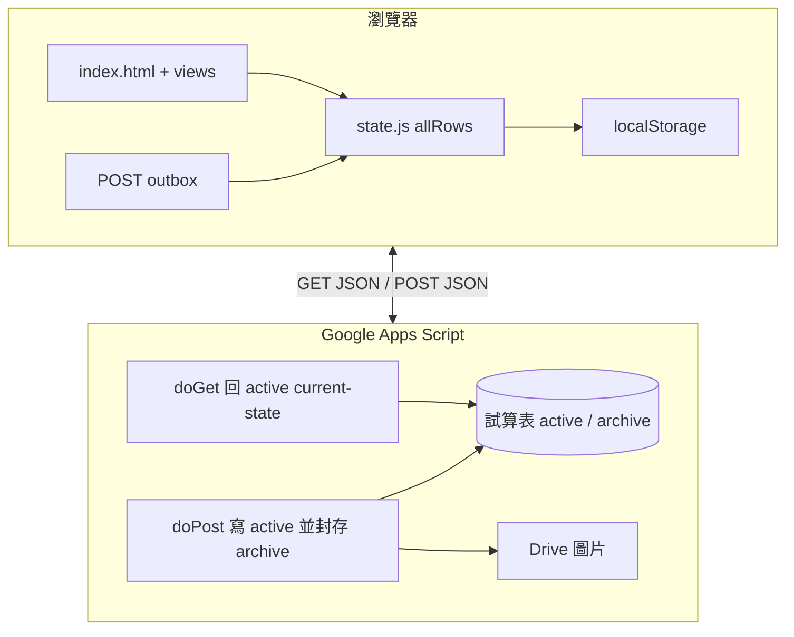

# 記帳本（Ledger App）

兩人**日常帳**與多人**出遊分帳**的 Web 應用：純靜態前端（ES Modules），資料經 **Google Apps Script (GAS)** 讀寫 **Google 試算表**，瀏覽器端以 **localStorage** 快取並支援**離線 POST 佇列**，弱網或斷線時仍可操作、連線後自動補送。

---

## 目錄

- [技術棧與架構](#技術棧與架構)
- [功能總覽](#功能總覽)
- [專案結構](#專案結構)
- [本機開發](#本機開發)
- [設定與覆寫](#設定與覆寫)
- [資料模型與同步](#資料模型與同步)
- [運算邏輯](#運算邏輯)
- [後端（GAS）與試算表](#後端gas與試算表)
- [PWA 與 Service Worker](#pwa-與-service-worker)
- [部署](#部署)
- [測試](#測試)
- [效能與擴充規劃](#效能與擴充規劃)
- [疑難排解](#疑難排解)
- [維運與文件索引](#維運與文件索引)

---

## 技術棧與架構

| 層級 | 技術 |
|------|------|
| 前端 | HTML / CSS / 原生 JavaScript（ES Modules），無打包器 |
| 資料持久化 | Google 試算表（經 GAS Web App） |
| 本機快取 | `localStorage`（日常／出遊分鍵儲存） |
| 離線 | POST 佇列（FIFO）、Service Worker 靜態快取 |
| 測試 | [Vitest](https://vitest.dev/) |
| PWA | `manifest.json` + `sw.js` |



---

## 功能總覽

### 日常記帳

- 新增消費：均分、僅單方、兩人各付等分攤模式。
- 歷史紀錄：編輯分類、備註、照片、日期；支援作廢。
- **還款**：記錄清帳事件；介面以無條件進位顯示整數還款額，餘額計算則扣精確欠款（見 [運算邏輯](#運算邏輯)）。
- 分類：可搭配 GAS 端 **Gemini** 自動建議類別（見 [docs/gas程式碼.md](docs/gas程式碼.md)）。

### 出遊分帳

- 建立行程、管理成員（多人）、行程色彩等。
- 消費紀錄：單人付款、多人出款、自訂分攤；可附註、照片、分類。
- **賭博模式**：表單與統計／分析頁可區分一般支出與賭博類別（圓餅與排行邏輯另有規則）。
- 行程統計：先付排行、分類圓餅、淨額與建議轉帳、收合式區塊等。
- **已結束行程結案報告**：可整理「誰總共付了多少、誰實際分攤多少、最後誰該付誰」，並支援複製文字摘要或下載分享圖片。
- **出遊詳情「歷史紀錄」**（`js/views-trip-detail.js`）：標題列可顯示行程日期區間；週曆列左右切週、點選單日篩選（再點同日取消＝**查看全部**）。**查看全部**時列表上方為「全部 · N 筆」與消費小計加總，**不依日期分組**；單日篩選時仍依該日顯示筆數與小計。收合區塊時不顯示標題列上的日期區間文案。
- 行程結束／重新開啟、成員改名／刪除、頭像與配色。
- 其他互動：例如抽籤、小遊戲等（見 `js/trip-lottery.js`、`js/trip-play-number-bomb.js`）。

### 分析頁

- 週期：本週／本月／本年（台北時區，見 `js/time.js`）。
- 兩人付出統計、分類圓餅（可切換顯示分類／比例／金額）。
- 含賭博時之輸贏／合計呈現與說明文案。

### 同步、備份與無障礙

- 同步狀態列：同步中／已同步／僅快取；背景輪詢發現資料變更可提示「資料已更新」。
- **備份與匯出**：CSV／文字備份（`js/backup.js`）；選單標題下顯示**日常帳精確欠款**（浮點）與進位還款額供對帳；可清除本機快取（不刪試算表）。
- 對話框焦點陷阱、深色模式（`js/theme.js`）等。

---

## 專案結構

根目錄主要檔案：

| 路徑 | 說明 |
|------|------|
| [index.html](index.html) | 唯一 HTML 入口；含 `<base>` 修正（GitHub Pages 子路徑）、PWA meta |
| [css/](css/) | 全站樣式（依用途分多檔，載入順序見 `index.html`） |
| [manifest.json](manifest.json) | PWA 名稱、圖示、`start_url` |
| [sw.js](sw.js) | Service Worker；**`CACHE_NAME` 版本號**變更可強制更新快取資源 |
| [.nojekyll](.nojekyll) | GitHub Pages 不使用 Jekyll |

`js/` 模組職責精簡對照：

| 區塊 | 代表檔案 |
|------|----------|
| 啟動／路由 | `main.js`、`bootstrap.js`、`router.js`、`navigation.js` |
| 狀態 | `state.js`、`state-accessors.js`、`render-registry.js` |
| API／快取／離線 | `api.js`、`offline-queue.js`、`js/sync/*.js`、`config.js` |
| 資料與模型 | `data.js`、`js/data/*.js`、`model.js` |
| 商業邏輯 | `finance.js`、`trip-stats.js`、`category.js`、`time.js` |
| 畫面 | `views-home.js`、`views-trips.js`、`views-trip-detail.js`、`js/views-trip-detail/*.js`、`views-analysis.js`、`views-shared.js` |
| 互動 | `actions.js`、`js/actions/*.js`、`dialog.js`、`globals.js`（掛載 `window` 供 inline 呼叫） |
| 其他 | `pie-chart.js`、`sync-ui.js`、`sync-pause.js`、`session-ui.js`、`device-info.js`、`utils.js` |

模組邊界補充：

- `data.js`、`offline-queue.js`、`views-trip-detail.js` 是對外穩定入口；內部實作分別放在 `js/data/`、`js/sync/`、`js/views-trip-detail/`
- `api.js` 保留流程控制與 I/O；schema migration、outbox merge、pending cleanup 抽到 `js/sync/`
- `gas/current-state.gs` 仍維持單檔部署，但檔內章節固定為：sheet schema、row utils、active mutations、migration、media upload、HTTP handlers

**更細的檔案地圖**請見 [docs/project-structure.md](docs/project-structure.md)。

---

## 本機開發

### 需求

- **Node.js**（建議 LTS）：僅用於安裝 dev 依賴與執行測試。
- 可提供**靜態檔案**的本機伺服器（勿用 `file://` 開 `index.html`，ES Modules 會失敗）。

### 安裝

```bash
npm install
```

### 常用指令

| 指令 | 說明 |
|------|------|
| `npm test` | 執行 Vitest（`test/*.test.js`） |
| `npm run icons:flatten` | 圖示處理（見 `scripts/flatten-app-icons.mjs`） |
| `npm run icons:prepare` | 圖示處理（見 `scripts/prepare-app-icons.mjs`） |

### 啟動靜態伺服器（擇一）

```bash
python3 -m http.server 8080
# 或
npx serve
```

瀏覽器開啟對應網址（例如 `http://localhost:8080/`），勿省略子路徑規則時的尾隨 `/`（與線上 GitHub Pages 行為一致時較穩）。

---

## 設定與覆寫

### GAS Web App URL

- **預設**：`js/config.js` 內 `DEFAULT_API`。
- **覆寫方式 A**：在載入 `js/main.js` **之前**設定  
  `window.__LEDGER_API_URL__ = 'https://script.google.com/macros/s/.../exec'`
- **覆寫方式 B**：應用內呼叫 `setApiUrl(url)`（`js/actions.js`，並透過 `globals.js` 掛到介面）寫入 `localStorage` 鍵 `ledger_api_url_v1`。

重新部署 GAS 後，**部署 URL 可能變更**，務必同步更新前端。

### 日常帳兩位使用者名稱

`js/config.js`：

- `USER_A`、`USER_B`：影響結算顯示、分攤按鈕文案、分析頁標籤等。

### 時區

- `TIMEZONE`（預設 `Asia/Taipei`）：與分析週期、POST 附帶時刻等一致。

### 選用：`window` 旗標（載入 main 前設定）

| 旗標 | 效果 |
|------|------|
| `__LEDGER_APPEND_DEVICE__ = false` | POST 不附帶 `_clientDevice` |
| `__LEDGER_APPEND_POSTED_AT__ = false` | POST 不附帶 `_clientPostedAt`（僅時分秒，不含日期） |

詳見 [js/config.js](js/config.js) 註解。

---

## 資料模型與同步

### current-state 與 archive

試算表目前採兩層結構：

- **active current-state**：只保留目前有效資料，供首頁、行程、分析頁平常讀取
- **archive 封存事件**：保留新增、編輯、撤回等完整歷程，供歷史查詢使用

其中日常 / 還款 / 出遊消費 / 出遊還款這些帳務資料，若使用者選的是「撤回」，active 不會真刪列，而是將該列標成 `voided=true`。  
前端平常直接消費 current-state；只有像「出遊金額修訂紀錄」這類需求，才會額外查 archive。

為了兼容舊資料或重試造成的重複列，前端顯示與結算仍會對同一 `id` 做去重。

### GET（全量拉取）

- `loadData()` 向 GAS 取得 **JSON 陣列**，正規化後寫入 `appState.allRows`，並 `saveCache()`。
- 具 timeout、重試、指數退避與 jitter（`GET_TIMEOUT_MS`、`GET_MAX_RETRIES` 等）。

### POST 與離線佇列

- 可重試的失敗會進入 **outbox**（`POST_OUTBOX_KEY`），連線恢復後自動依序送出。
- 與伺服端資料合併時，會處理**尚未上傳成功的 pending 列**（`mergeFreshWithOutboxBackedPending`）。
- current-state 版本升級時，前端會依 `CLIENT_DATA_SCHEMA_VERSION` 做一次性清理，移除舊快取與舊 outbox，避免舊事件語意把已撤回資料或已結束行程覆蓋回來。

### 背景輪詢

- 間隔見 `POLL_MS`（預設 5 分鐘）；分頁隱藏、使用者正在表單輸入時會暫停或延後（`sync-pause.js`）。
- 若拉取結果與本地相同，可避免不必要重繪；有變更時可顯示更新提示。

### localStorage 鍵一覽

| 鍵 | 用途 |
|----|------|
| `gasRows_daily_v2` | 日常相關列快取 |
| `gasRows_trip_v2` | 出遊相關列快取 |
| `ledger_sync_last_at_v1` | 上次成功自 GAS 拉取並寫入的時間（ms） |
| `ledger_api_url_v1` | 覆寫 API URL |
| `ledger_post_outbox_v1` | POST 離線佇列 |
| `ledger_data_schema_v1` | 前端本地資料 schema 版本 |
| `theme` | 深色模式偏好 |
| 其他 | 工作階段還原等（見 `session-ui.js`） |

舊版快取鍵在成功同步時會一併清除（`CACHE_LEGACY_KEYS`）。

---

## 運算邏輯

核心實作位於 [`js/finance.js`](js/finance.js)。日常帳與出遊分帳採**不同結算模型**，請勿混用。

### 日常帳結餘（`computeBalance`）

**語意：** 以「胡」為基準的淨欠款。

| `computeBalance` 結果 | 意義 |
|----------------------|------|
| 正數 | `USER_B` 欠 `USER_A` |
| 負數 | `USER_A` 欠 `USER_B` |
| 0 | 帳目已清 |

**走帳順序：** 紀錄先依日期／時間排序（`getDailyRecords` → 新到舊），計算時**反轉為由舊到新**，逐筆更新 running balance（`nextDailyLedgerBalance`）。歷史列表旁的 running 小計、分析頁日／月變化皆共用同一函式。

#### 單筆消費增量（`dailyExpenseBalanceDeltaForUserA`）

僅 `type === 'daily'` 且未撤回者計入。

| 分攤模式 | 規則 |
|---------|------|
| **均分** | 各負擔 `amount / 2`（保留浮點，如 101 → 50.5） |
| **只有胡／只有詹** | 全額算在指定一方 |
| **兩人付** | `(paidHu - paidZhan) / 2` |

付款方為「胡」時，增量 = 詹的分攤額；付款方為「詹」時，增量 = −胡的分攤額。

#### 日常還款（`type === 'settlement'`）

- **介面／試算表紀錄：** 還款金額為 `Math.ceil(|精確欠款|)`（整數元，方便轉帳）。
- **餘額計算（有對應欠款時）：** 扣（或加回）**當下精確欠款** `Math.abs(running)`，**不以紀錄列上的進位金額相減**。

範例：均分 5 元、胡付 → 精確欠款 2.5；首頁顯示還 **3** 元，寫入試算表 **3** 元，餘額扣 **2.5** → 0。多付的 0.5 元**不**轉成反向欠款。

- **餘額計算（先前消費已撤回、重算時無欠款）：** 還款列視為**多繳**，以**紀錄金額**（進位整數）轉為反向餘額，讓還款方可追回。例：均分 101 後還款 51，再撤回該筆消費 → 餘額 **−51**（胡欠詹 51，即還款人多拿回的額度）。若帳上曾有**編輯**事件列，資料層須正確讀取試算表 `voided=true`（見 `daily-selectors.js`）。

還款後若有新消費，自該筆起繼續累加；多繳與新欠款會在同一條時間線上合併（例如多繳 51、之後新欠 10 → 淨額 −41）。

撤回還款列（`voided`）則不影響 running balance。

#### 顯示 vs 計算

| 用途 | 規則 | 位置 |
|------|------|------|
| 首頁大數字、還款確認 | `Math.ceil` 整數 | `views-home.js`、`actions/home-daily.js` |
| 精確欠款對帳 | 浮點原文 | 備份選單、`backup.js` → `describeDailyBalanceExact` |
| 文字備份開頭 | 同上 | `allRowsToBackupText` |

### 出遊分帳（`computeSettlements`）

多人行程與日常帳獨立：

1. 每筆消費依 `computeExpenseShares` 分攤（含匯差手續費 `fxFeeNtd`、自訂 `splitDetails`、多人 `payers` 出款）。
2. 累計每人「先付 − 應分攤」淨額。
3. 已記錄的 **出遊還款**（`tripSettlement`）作為 `adjustments` 自淨額抵銷。
4. 以 greedy 配對產生「誰該付誰」建議；單筆建議金額為浮點，**記錄還款時**同樣 `Math.ceil`。

出遊頁的「還款」按鈕寫入 `tripSettlement`；試算表工作表為 **`出遊還款`**（與日常 **`日常還款`** 分開）。

### 賭博統計

- **日常：** `accumulateDailyGamblingWinLose` — 僅 `category === 賭博` 之 daily 列，依結餘增量拆贏／輸。
- **出遊：** `computeTripGamblingWinLoseByMember` — 每人「代收／先付 − 分攤負擔」。

分析頁圓餅與說明文案另見 `views-analysis.js`、`category.js`。

### 測試對照

| 檔案 | 相關案例 |
|------|---------|
| `test/finance.test.js` | 均分浮點、還款扣精確值、出遊分攤／匯差、賭博 |
| `test/trip-stats.test.js` | 行程摘要、已記錄還款抵銷 |
| `test/refactor-regression.test.js` | settlement、voided、outbox 合併 golden |

---

## 後端（GAS）與試算表

專案內 **GAS 範例與說明**見 [docs/gas程式碼.md](docs/gas程式碼.md)（需自行建立 Apps Script 專案並綁定試算表）。

重點摘要：

- **Active 工作表**（current-state）：`日常消費`、`日常還款`、`行程`、`出遊消費`、`出遊還款`、`成員`、`頭像`。日常消費與日常還款為**不同分頁**；新增還款請在 `日常還款` 查看，勿與舊版 append-only 的 `日常` 分頁混淆。
- **Archive 工作表**：`封存_日常事件`、`封存_出遊事件`、`封存_人物事件`。
- 工作表分成 **active current-state** 與 **archive 封存事件** 兩層，細節見 [docs/gas程式碼.md](docs/gas程式碼.md)。
- **doGet**：預設只回傳 active current-state；`?mode=history` 可查單筆歷史，也可只帶 `type` 查該類 archive。
- **doPost**：新增寫入 active 並同步封存；編輯直接覆寫 active；歷史紀錄內的帳務資料只會「撤回」不會真刪除。
- 金額編輯仍會保留 archive 歷史，備註與分類則直接覆寫 active。
- 舊 append-only 試算表可透過 `migrateLegacyEventsToCurrentState()` 遷移到新結構。
- **圖片**：上傳至 Drive 指定資料夾子路徑（日常／出遊照片、頭像等），大小上限見該文件。

部署為「網路應用程式」時：

1. 執行身分通常為「我」。
2. 存取權需依實際使用者範圍設定（例如「任何人」或機構內）。
3. 每次新版本部署後確認 **URL 是否變更** 並更新前端。

---

## PWA 與 Service Worker

- 安裝至主畫面後以 `standalone` 顯示（見 `manifest.json`）。
- `sw.js` 快取靜態資源清單；**變更 `CACHE_NAME`**（例如 `ledger-v78` → `ledger-v79`）可讓既有使用者取得新 JS/CSS。
- 新增 `js/` 檔案且需離線可用時，記得把路徑加入 `STATIC_ASSETS`。

---

## 部署

### GitHub Pages

- 來源通常為 **`main` 分支根目錄**。
- 網址形如：`https://<帳號>.github.io/<repo>/`
- **務必使用結尾 `/` 的網址**（例如 `.../repo/`），避免相對路徑錯誤；`index.html` 內已用 `<base>` 輔助修正。
- 根目錄保留 `.nojekyll`。

### 發布後建議驗收

見 [docs/operations-checklist.md](docs/operations-checklist.md)。

---

## 測試

```bash
npm test
```

| 檔案 | 涵蓋方向 |
|------|----------|
| `test/finance.test.js` | 日常結餘、還款扣精確值、出遊分攤／匯差、賭博 |
| `test/data.test.js` | 事件列轉顯示資料、stale settlement 過濾 |
| `test/offline-queue.test.js` | 離線佇列與 pending 合併 |
| `test/refactor-regression.test.js` | fixture / golden 回歸（`voided`、`closed`、rename、settlement、outbox merge） |
| `test/trip-stats.test.js` | 行程統計摘要 |
| `test/time.test.js` | 台北時區、分析週期 |
| `test/utils.test.js` | 工具函式 |
| `test/actions-shared.test.js` | 未同步還款列丟棄等 actions 共用邏輯 |

目前共 **83** 項測試。設定檔：[vitest.config.js](vitest.config.js)。

---

## 疑難排解

| 現象 | 建議 |
|------|------|
| 線上版仍是舊 UI | 強制重新整理（`Cmd+Shift+R` / `Ctrl+Shift+R`）；或關閉分頁重開；檢查 `sw.js` 快取版本是否已更新 |
| 長期「僅快取」或同步失敗 | 確認 `API_URL`、GAS 部署權限、試算表連結是否正常 |
| 日常記帳有更新、還款在試算表看不到 | 確認是否開啟 **`日常還款`** 分頁（非 `日常消費`、非舊版 `日常`） |
| 行程狀態或已撤回資料看起來被加回來 | 先強制重新整理一次；current-state 版前端會清掉舊快取 / 舊 outbox，避免舊事件模型覆蓋新資料 |
| 新增後對方看不到 | 確認對方也完成同步；背景輪詢或手動重新整理 |
| 儲存空間／Quota | 快取含大量資料或照片 metadata 時可能觸頂；備份後使用「清除本地快取」再同步 |
| ES Module 載入失敗 | 勿用 `file://`；改用本機 HTTP 伺服器 |

---

## 維運與文件索引

| 文件 | 內容 |
|------|------|
| [docs/project-structure.md](docs/project-structure.md) | 檔案地圖（依職責分類） |
| [docs/workflow.md](docs/workflow.md) | 開發順序與同步重點 |
| [docs/operations-checklist.md](docs/operations-checklist.md) | 部署、驗收、排錯 |
| [docs/gas程式碼.md](docs/gas程式碼.md) | GAS 與試算表邏輯參考 |

修改建議對照：

- 同步流程：`js/bootstrap.js`、`js/api.js`、`js/offline-queue.js`、`js/sync/*.js`
- 畫面：`js/views-*.js`、`js/views-trip-detail/*.js` → `js/actions.js`（`js/actions/` 子模組）、`css/*.css`
- 結算與規則：`js/finance.js`、`js/data.js`、`js/data/*.js`、`js/model.js`（運算邏輯詳見上文 [運算邏輯](#運算邏輯)）
- 備份／精確欠款顯示：`js/backup.js`
- PWA／離線資源：`sw.js`、`manifest.json`

---

## 授權與免責

本專案為私用記帳工具範本，可依需求自行修改延伸。正式多人共用時，建議補強：權限控管、稽核、錯誤追蹤、備份還原演練與端到端測試等。
